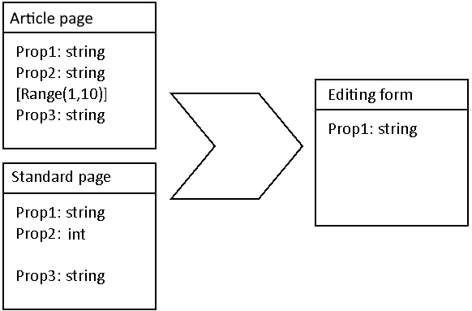

# Bulk Edit

Repository for documentation and issues tracking for BulkEdit EPiserver addon.

## Supported versions

The supported version is EPiServer.CMS 12.17.1+. EPiserver 11 is not supported.

## Install

```
Install-Package Advanced.CMS.BulkEdit
```

In order to start using BulkEdit module you need to add the following statement to Startup.cs

```c#
public class Startup
{
    ...
    public void ConfigureServices(IServiceCollection services)
    {
        ...
        services.AddBulkEdit();
        ...
    }
    ...
}
```

## Using BulkEdit addon

Bulk Edit is a command available in the page tree. It can be selected from any tree item that has children.


After selecting the command, a dialog box is displayed with a selection of pages. You can edit all children, or all descendants.

The list can also be filtered by type.

By selecting the "selected" option, you can manually select the pages to be edited.


Once Editor have decided which pages he wants to edit, he need to select the fields. This is done in an editing form similar to that used in ContentArea.
The difference is that a checkbox is available next to each field label, which is used to select the fields to be edited. After selecting the checkbox, Editor needs to enter the value, which will be set, for all selected pages. More than one field can be selected.

By default, the value of the first selected page is used.


After clicking **Next**, Editor see progress dialog and content items are updated 


### Handling errors

When saving an item and error occured, the bulk edit continue updating other items. Error message is displayed next to content name.


### Publishing edited content

When using the Bulk Edit module, new draft pages are created, but they are not published. To improve publishng process, the Editor can add edited items to the project and use the Bulk Edit command available in the project overview.


### Hiding properties on bulk edit form

By default, the Bulk Edit module allows you to eydt all fields defined on ContentType. You can change this behavior through code and hide selected properties on the editing form. To do this we need to use the `AllowBulkEdit` attribute, which is configured on the field.

In the following example, the **TestProperty** field will not be editable with BulkEdit.
```c#
[ContentType(GUID = "638D8271-5CA3-4C72-BABC-3E8779233263")]
public class NewsPage : PageData
{
    // ...

    [AllowBulkEdit(false)]
    public virtual string TestProperty { get; set; }

    // ...
}
```

## How form is created

Form is created as a subset of selected ContentTypes. The properties have to match by name, type, but also by settings.



In the example only Prop1 will be displayed in the editing form, because other properties does not match by type of settings.


## Limitations

### There is no transaction

Editing content items using bulk edit will not start the transaction. Each content is saved separately.
The update will not sop when one of the content was not saved successfully.

### Options

Some parts of the module are configurable using option classes.

#### BulkEditOptions

| Option        | Type | Default           | Description  |
| ---- | ---- | ---- | ---- |
| DefaultAllowBulkEditOnProperty | boolean | true | When true, then command is added to page tree |
| ProjectCommandEnabled | boolean | true | When true, then command is added to projects overview |
| MaximumSafeContentItemsToUpdate | boolean | true | Above this number the notification background color will change to warning |

Example:

```c#
public class Startup
{
    ...
    public void ConfigureServices(IServiceCollection services)
    {
        ...
            services.Configure<BulkEditUiOptions>(o =>
            {
                o.PageTreeCommandEnabled = false;
                o.ProjectCommandEnabled = false;
                o.MaximumSafeContentItemsToUpdate = 1000;
            });
    ...
}
```

#### BulkEditUiOptions


| Option        | Type | Default           | Description  |
| ---- | ---- | ---- | ---- |
| PageTreeCommandEnabled | boolean | true | When true then bulk edit is enabled for property without using AllowBulkEdit attribute |

```c#
public class Startup
{
    ...
    public void ConfigureServices(IServiceCollection services)
    {
        ...
            services.Configure<BulkEditOptions>(o =>
            {
                o.DefaultAllowBulkEditOnProperty = false;
            });
    ...
}
```


## Reporting bugs and requesting new features

To report bugs or request for new features please use [Issues](https://github.com/gregwiechec/bulk-edit-documentation/issues) tab.  
